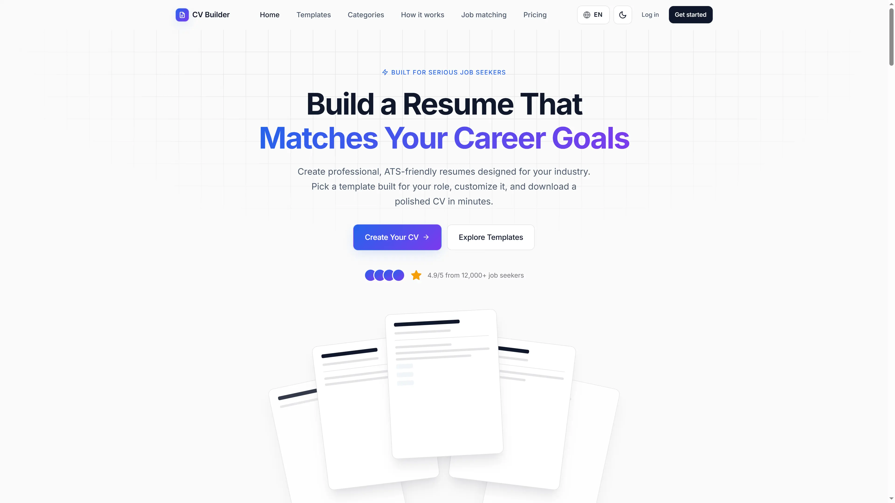
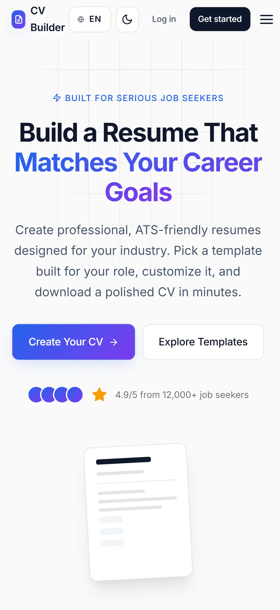
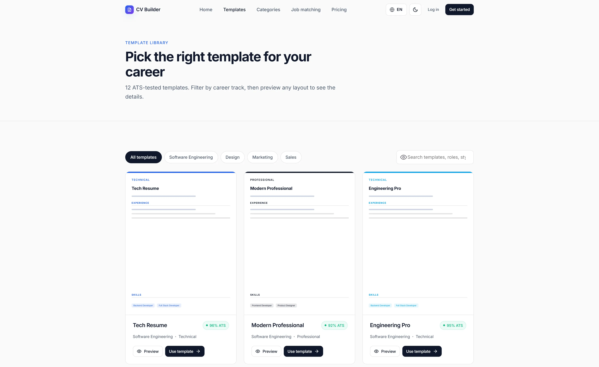
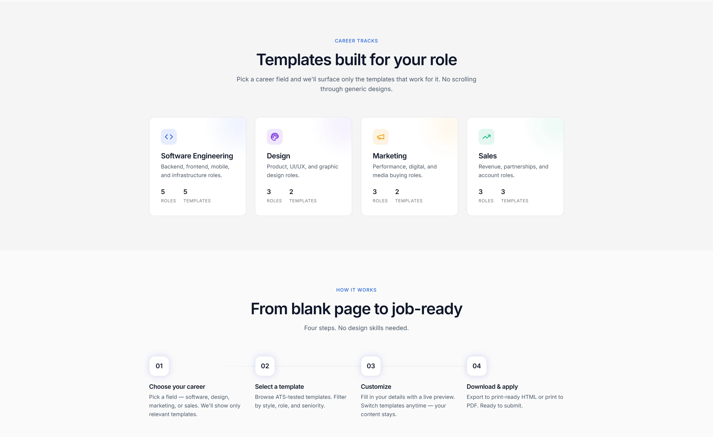
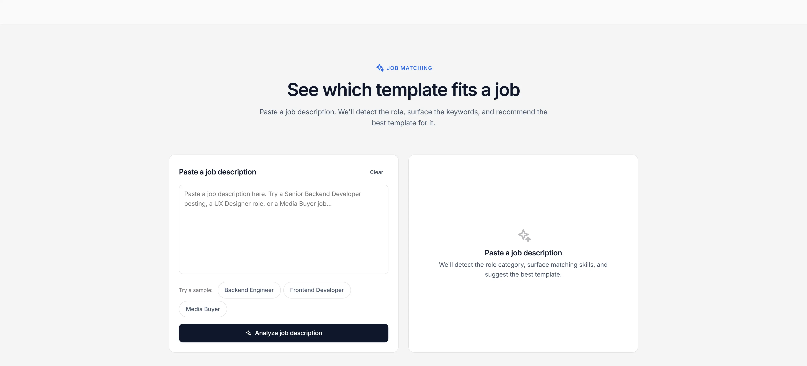
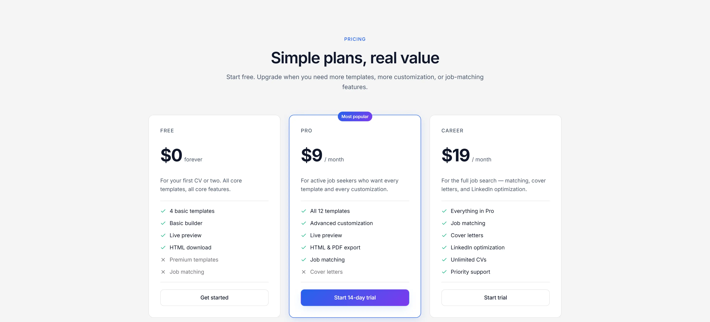
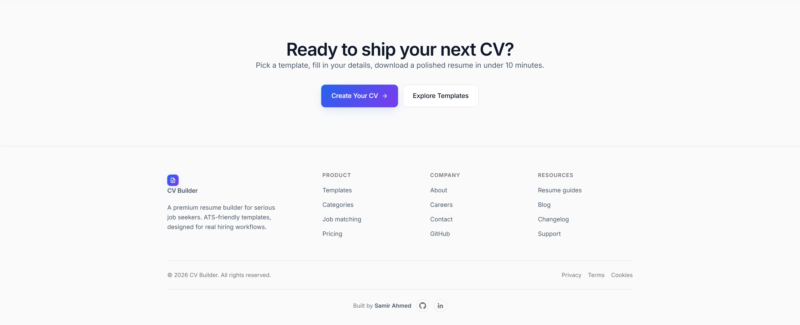

# CV Builder — Portfolio Project

A premium, **fully bilingual (English / Arabic)** CV builder platform with ATS-friendly resume templates designed for software engineers, designers, marketers, and sales professionals.

## Live Demo

**[View CV Builder Live →](https://samirahmed00.github.io/CV-Builder-Landing-Page/)**


This is a **frontend-only portfolio project** built as a complete product experience rather than a static landing page. It includes a responsive marketing page, template library, interactive CV builder, job description analyzer, dark mode, bilingual EN / AR support, and animated interactions.

## Overview

CV Builder is designed around a simple idea:

> Build a resume that matches your career goals.

The project combines a premium SaaS-style landing page with functional frontend experiences that allow users to explore templates, build a CV, analyze job descriptions, and prepare a resume for real hiring workflows.

The interface focuses heavily on visual hierarchy, responsive design, usability, accessibility, and polished product presentation.

## What's Inside

* **Landing page** (`index.html`) — premium SaaS-style hero, template showcase, career categories, how-it-works, live job-matching demo, features, pricing, and footer
* **Template library** (`templates.html`) — 12 ATS-tested templates, filterable by career, with a preview modal
* **Builder** (`builder.html`) — live CV builder with a working form, four tabs, dynamic experience / education / projects / skills, and a print-quality live preview
* **Job analyzer** — paste a job description to detect the role category, extract keywords, identify missing skills, and recommend a template
* **Dark mode** — full theme with a paper-white CV preview that stays readable
* **Bilingual EN / AR** — complete UI in both languages with RTL support, automatic font switching, language toggle, and language-aware sample CV data

## Key Features

* Premium SaaS-style interface
* Fully responsive layouts
* 12 professional resume templates
* Career-based template filtering
* Template preview modal
* Interactive CV builder
* Live CV preview
* Dynamic experience, education, projects, and skills
* Template switching without losing content
* Local storage persistence
* Print-ready HTML export
* Browser-based PDF printing
* Job description analyzer
* Keyword detection
* Missing-skill suggestions
* Career category detection
* Recommended resume templates
* Dark mode
* English / Arabic localization
* RTL layout support
* Responsive navigation
* GSAP-powered animations
* Reduced-motion support
* Accessibility-focused implementation

## Website Sections

### Hero

Introduces the CV Builder product and communicates its main value proposition with a strong call to action.

### Template Library

Showcases professional resume templates and allows users to explore different layouts designed around real career categories.

### Career Tracks

Organizes templates around four main professional fields:

* Software Engineering
* Design
* Marketing
* Sales

### How It Works

Explains the complete resume-building workflow:

1. Choose your career
2. Select a template
3. Customize your CV
4. Download and apply

### Job Matching

Provides an interactive frontend job-matching experience where users can paste a job description and receive:

* Detected career category
* Matching keywords
* Missing keywords
* Recommended template
* Direct handoff to the CV builder

### Features

Highlights the main product benefits:

* ATS optimization
* Professional templates
* Career-based suggestions
* Live preview
* Easy customization
* Job description matching

### Pricing

Presents three plans:

* Free
* Pro
* Career

Each plan communicates its included features and intended use case.

### Final CTA

Concludes the landing page with a focused call to action encouraging users to start building their next CV.

## Template Explorer

The project includes **12 templates across 4 career tracks**.

Each template has:

* Unique layout
* Career category
* Style classification
* ATS score
* Supported roles
* Preview experience

Users can filter templates by career and open a preview modal before selecting one.

## CV Builder

The builder provides a complete frontend resume editing experience.

### Features

* Live preview on every keystroke
* Four editing tabs
* Personal information
* Experience
* Education
* Skills
* Projects
* Dynamic entry management
* Skill chips
* Template switching
* Persistent CV state
* Print-ready HTML export
* Browser PDF printing

The application stores the CV state in `localStorage`, allowing users to continue working between sessions.

## Job Description Analyzer

The job analyzer is implemented entirely on the frontend.

Users can paste a job description and receive:

* Detected category
* Confidence information
* Recommended template
* Matched keywords
* Missing keywords
* One-click handoff to the builder

The skill dictionary is curated per career category.

## Bilingual Experience

The project ships with a single codebase supporting both English and Arabic.

### Language Features

* EN / AR language toggle
* Automatic language detection
* Language preference stored in `localStorage`
* Full RTL layout for Arabic
* Automatic font switching
* Language-aware sample CV
* Localized template data
* Localized career categories
* Localized job analyzer interface

When Arabic is selected, the application switches the document direction to RTL and adapts the builder, CV layouts, typography, spacing, and navigation accordingly.

## Dark Mode

The application includes a complete dark theme.

The surrounding interface switches to a dark color system while the CV paper itself remains white to preserve realistic resume readability.

## Animations

The project uses **GSAP** for:

* Hero timeline animations
* Floating CV previews
* Subtle scroll reveals

`IntersectionObserver` is also used for reveal-on-scroll behavior, with support for `prefers-reduced-motion`.

## Design System

The visual direction is inspired by modern SaaS products such as Stripe, Linear, and Framer.

### Core Design Tokens

| Token            | Value          |
| ---------------- | -------------- |
| Primary          | `#2563EB`      |
| Accent           | `#7C3AED`      |
| Light Background | `#FAFAFA`      |
| Dark Background  | `#0F172A`      |
| English Font     | Inter          |
| Arabic Font      | Cairo          |
| Monospace Font   | JetBrains Mono |

Design tokens are centralized in `css/main.css`, while Arabic-specific overrides are maintained in `css/rtl.css`.

## Project Structure

```text
cv-builder/
├── index.html
├── templates.html
├── builder.html
├── css/
│   ├── main.css
│   ├── components.css
│   └── rtl.css
├── js/
│   ├── i18n.js
│   ├── app.js
│   ├── templates.js
│   ├── analyzer.js
│   └── builder.js
├── data/
│   ├── templates.json
│   ├── categories.json
│   └── jobs.json
└── assets/
    └── screenshots/
```

## Running Locally

This is a static frontend project with no build step or backend.

Because the application loads local JSON files using `fetch()`, it is recommended to serve the project through a local HTTP server.

### Python

```bash
python3 -m http.server 8765
```

Then open:

```text
http://localhost:8765
```

### Node.js

```bash
npx serve .
```

No `npm install`, bundler, or build process is required.

## Accessibility

Accessibility was considered throughout the interface:

* Semantic HTML landmarks
* Accessible icon-only buttons
* Keyboard navigation
* Visible focus states
* Reduced-motion support
* WCAG AA color contrast
* Dynamic `lang` and `dir` attributes
* RTL support for Arabic users

## Screenshots

### Hero



### Responsive Hero



### Template Library



### Career Tracks



### Job Matching



### Pricing



### Final CTA



## Project Goals

This project was built to practice creating a realistic product experience with a strong focus on:

* Product storytelling
* Conversion-oriented UX
* Responsive design
* Interactive frontend experiences
* Information architecture
* Localization and RTL support
* Accessibility
* Visual consistency
* Modern SaaS interface design
* Frontend state management without a backend

## What Was Deliberately Not Done

The project intentionally avoids:

* Fake stock photography
* Skill percentage bars
* Childish or overly colorful resume templates
* Backend dependencies
* Unnecessary build tooling

The CV data and application state are handled entirely on the frontend using JavaScript, `localStorage`, and JSON data files.

## License

Portfolio project. Use it however you like.

## Author

**Samir Ahmed**

Backend .NET Developer focused on building production-style web applications and polished digital experiences.

GitHub: [SamirAhmed00](https://github.com/SamirAhmed00)
